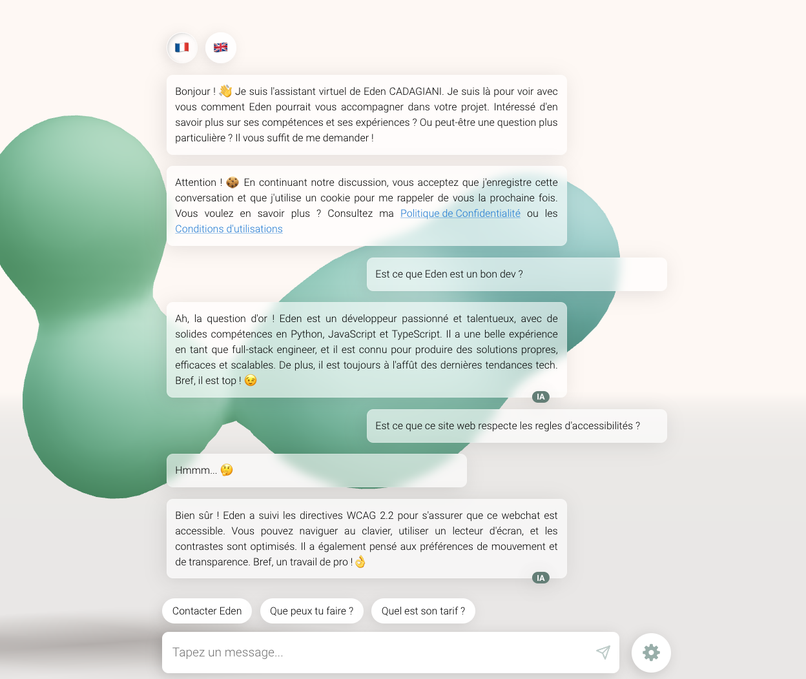
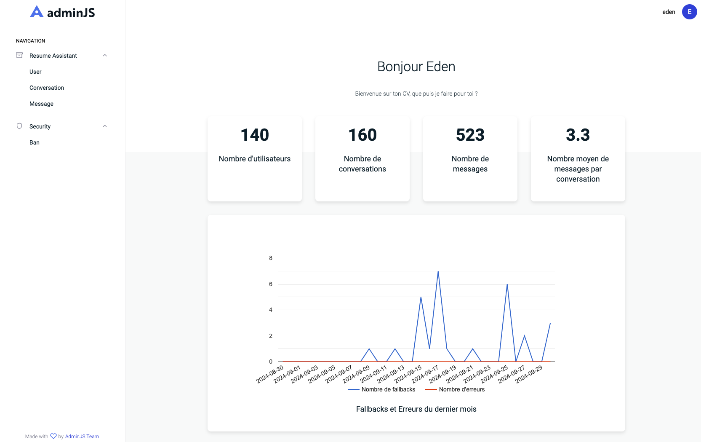

# Resume Assistant

An interactive AI-powered resume chatbot that helps users explore my professional experience, skills, and background in a conversational way. 

## Live Demo
Experience the chatbot: [https://ecadagiani.fr](https://ecadagiani.fr?o=github)

## Screenshots





## License
This project is licensed under the [Attribution-NonCommercial 4.0 International (CC BY-NC 4.0) License](LICENSE)


## Key Features
- Natural language processing for intuitive interactions
- Multi-language support (English, French)
- threeJS UI with mysterious meta-balls
- Intriguing skill and experience visualization
- NLU and LLM for cost management of responses
- Semantic cache for LLM responses
- RAG for more accurate and up-to-date responses


## Architecture
### Core Components
- **Frontend**: React, Recoil, styled-components
- **Backend**: Express.js server with Socket.IO
- **Database**: MongoDB for persistence, Redis for caching
- **Infrastructure**: Docker, Google Cloud Platform, AWS
- **AI Layer**: 
  - Dialogflow for NLU
  - OpenAI GPT4 for complex queries
  - Fine-tuned GPT4-mini for cost optimization
  - RAG system for accurate responses
  - Semantic cache for response optimization


## Setup

### Prerequisites
- Node.js >= 22
- Docker & Docker Compose
- Dialogflow project
- OpenAI API key

### Local Development
1. Clone the repository
   ```bash
   git clone https://github.com/yourusername/resume-assistant.git
   cd resume-assistant
   ```

2. Install dependencies
   ```bash
   cd client && npm install
   cd ../api && npm install
   ```

3. Copy `.env.dist` and configure values

4. Add OpenAI API key

5. Configure Dialogflow project and ID

### Google Cloud Setup
1. Install gcloud CLI (via Homebrew on macOS)
2. Run initial setup:
   ```bash
   gcloud init
   gcloud auth application-default login
   ```
3. Create service account key following [official documentation](https://cloud.google.com/iam/docs/keys-create-delete#creating)

### Create resources folder

The `api/resources` folder contains essential configuration files for the chatbot application. This guide explains how to set up the folder structure and create necessary files.

#### Folder Structure
```
api/resources/
├── images/
├── documents/
├── constants/
│   ├── buttons.js
│   ├── entity.js
│   ├── intents.js
│   ├── payloads.js
│   ├── questionId.js
│   ├── responseId.js
│   └── responsesData.js
├── locales/
│   ├── en/
│   │   ├── button.json
│   │   ├── common.json
│   │   ├── message.json
│   │   ├── skills.json
│   │   ├── smalltalk.json
│   │   └── timeline.json
│   └── fr/
│       ├── button.json
│       ├── common.json
│       ├── message.json
│       ├── skills.json
│       ├── smalltalk.json
│       └── timeline.json
```

#### Constants Files

##### 1. `constants/intents.js`
```javascript
// Define your chatbot intents:
export const INTENTS = {
  WELCOME: 'welcome',
  FALLBACK: 'Default Fallback Intent',
  SUMMARY: 'question.summary',
  // Add more intents
};

// Static intents structure:
export const STATIC_INTENTS = [
  {
    // Intent definition object
    triggers: {
      // Ways to match this intent
      fullEqual: [
        // Array of exact text matches
        'string1',
        'string2'
      ],
      regex: [
        // Array of regex patterns to match
        /pattern1/,
        /pattern2/
      ],
      firstWord: [
        // Array of words to match at start
        'word1',
        'word2' 
      ]
    },
    displayName: 'intent.name' // Intent name to trigger
  }
];


```

##### 2. `constants/payloads.js`
```javascript
// Define button payloads:
export const PAYLOADS = {
  SUMMARY: 'summary',
  SKILLS: 'skills',
  EXPERIENCE: 'experience',
  // Add more payloads
};
```

##### 3. `constants/questionId.js`
```javascript
// Map questions to specific IDs:
export const QUESTION_ID = {
  Q_UNKNOWN: 'unknown',
  Q_SUMMARY: 'summary',
  Q_SKILLS: 'skills',
  // Add more question IDs
};

// Map questions to specific IDs and their corresponding intents:
export const QUESTION_ID_MAP = {
  [QUESTION_ID.Q_SUMMARY]: INTENTS.SUMMARY,
  [QUESTION_ID.Q_SKILLS]: INTENTS.SKILLS,
  // Add more mappings
};
```

##### 4. `constants/responseId.js`
```javascript
// Define response identifiers:
export const RESPONSE_ID = {
  R_UNKNOWN: 'unknown',
  R_SUMMARY: 'summary',
  R_SKILLS: 'skills',
  // Add more response IDs
};

// Map response IDs to question IDs:
export const RESPONSE_ID_MAP = {
  [QUESTION_ID.Q_SUMMARY]: RESPONSE_ID.R_SUMMARY,
  [QUESTION_ID.Q_SKILLS]: RESPONSE_ID.R_SKILLS,
  // Add more mappings
};
```

##### 5. `constants/buttons.js`
```javascript
// Define button configurations:
export const BUTTONS = {
  SUMMARY: {
    id: 'summary',
    payload: PAYLOADS.SUMMARY,
    translationKey: 'summary'
  },
  // Add more buttons
};
```

##### 6. `constants/responsesData.js`
Define response templates:
```javascript

/**
 * Response data structure for chat messages
 * 
 * Response Types:
 * - TEXT_RESPONSE: Simple text message with content:
 *   - translations: Translation keys to use
 *   - multiLingual: If true, shows in multiple languages
 * - IMAGE: Display an image message with src, alt text, dimensions, and id
 * - RESTART: Restarts the conversation flow
 * - TEXT_WITH_IMAGE: Combines text message with an accompanying image
 * - FILE: Sends a downloadable file like PDF with metadata
 * - TIMELINE: Shows timeline events filtered by category
 * - SKILLS: Display skills grid with images and tooltips
 * 
 * Handler :
 * - JOKE_IMAGE: Shows a random programming meme/joke image
 * - CAN_WORK_TECHNOLOGY: Checks if can work with specific tech
 * - DID_WORK_TECHNOLOGY: Shows past experience with tech
 * - COMPANY_EXPERIENCE: Shows experience at specific company
 * - SMALLTALK: Handles casual conversation responses
 * 
 * Response Object Structure:
 * {
 *   handler: string              // If the response need a specific controller
 *   // OR
 *   responses: [{
 *     type: RESPONSE_TYPE,         // Response type
 *     handler: string              // If the response need a specific controller
 *     noScroll?: boolean,          // If true, prevents auto-scroll
 *     content?: {                  // Content for the response
 *       translations?: string[],   // For TEXT_RESPONSE, TEXT_WITH_IMAGE: Translation keys for text, if multiple is select a random one
 *       multiLingual?: boolean,    // For TEXT_RESPONSE, TEXT_WITH_IMAGE: If true, shows in multiple languages
 *       picture?: string,          // For TEXT_WITH_IMAGE: Image file name
 *       pictureAlt?: string,       // For TEXT_WITH_IMAGE: Image file alt text
 *       src?: string,              // For IMAGE: Image file name
 *       alt?: string,              // For IMAGE: Image alt text
 *       height?: number,           // For IMAGE: Image height
 *       width?: number,            // For IMAGE: Image width
 *       id?: string,               // For IMAGE: Image id
 *       fileType?: string,         // For FILE: File type
 *       urlByLanguage?: { [key: string]: string }, // For FILE: URL by language
 *       name?: string,      // For FILE: name
 *     }
 *     categories?: string[], // For TIMELINE: Filter events by category (SCHOOL|COMPANY|PROJECT|REWARD|FREELANCE)
 * 
 *   }]
 * }
 */

export const RESPONSES_DATA = {
  [RESPONSE_ID.R_SUMMARY]: {
    responses: [{
      type: 'TEXT_RESPONSE',
      content: {
        translations: ['summary_response']
      }
    }]
  },
  // Add more responses
};
```

##### 7. `constants/entity.js`
Define entities for natural language understanding:
```javascript
export const COMPANY_ENTITY = {
  name: ['company'],
  values: {
    company1: { value: 'company1', title: 'Company One' },
    company2: { value: 'company2', title: 'Company Two' },
  }
};

export const TECHNOLOGY_ENTITY = {
  name: ['technology', 'technology2'],
  values: TECHNOLOGY_VALUES,
};
```

#### Locales Files
Create JSON files in both `en` and `fr` folders, with i18next format.


## Glossary
- **User**: Person using the application
- **Conversation**: Collection of messages with timestamp
- **Message**: Contains user input, bot responses, input format, and buttons
- **userMessage**: User input text
- **response**: Bot output text
- **input**: Input format specification
- **buttons**: Available interaction buttons
- **serverResponse**: Socket message format
- **send_userMessage**: Socket event for user messages
- **send_responses**: Socket event for bot responses

## Testing Checklist
1. Basic Interactions
   - Send "hello" message
   - Send "test" message
   - Test button clicks
   - Test intent links

2. Contact Form Testing
   - Test contact form cancellation
   - Test invalid email validation (test@test, test@test.test)
   - Test valid email submission

3. LLM Integration
   - Verify streamed responses and buttons
   - Test response delay and waiting message
   - Verify timeout functionality

4. State Management
   - Test message persistence after page reload
   - Test reset functionality (button and command)
   - Verify language switching
   - Test multilingual support (French, English, Spanish)

5. Component Testing
   - Verify skills display and swiper
   - Test timeline view with modal and swiper
   - Check experience view and swiper
   - Test "Who is Eden" response
   - Verify CV display in French and English
   - Test joke response
   - Verify state persistence after page reload


## Tasks

### pull_submodules
pull submodules

directory: .

```
git submodule update --init --recursive
```

### dev_start_api
up all containers

directory: .

```
docker compose -f docker-compose.dev.yml up -d
```

### dev_start
starts all containers and the front vite in dev mode,

requires: dev_start_api
directory: ./client

```
npm run start
```

### dev_stop
stop all containers

directory: .

```
docker compose -f docker-compose.dev.yml stop
```

### dev_remove
down all containers and remove volume

directory: .

```
docker compose -f docker-compose.dev.yml down -v
```

### dev_restart
stop + up all containers + logs api

directory: .

```
docker compose -f docker-compose.dev.yml down && docker compose -f docker-compose.dev.yml up -d && docker compose -f docker-compose.dev.yml logs api -f
```

### dev_reset
Stops and removes the Docker containers, restart the Docker container

directory: .

```
docker compose -f docker-compose.dev.yml down -v && docker compose -f docker-compose.dev.yml up -d && docker compose -f docker-compose.dev.yml logs api -f
```


### dev_reset_api
Stops and removes the Docker containers, restart the Docker container

directory: .

```
docker compose -f docker-compose.dev.yml down && docker volume rm $(docker volume ls -q | grep db_data) && docker compose -f docker-compose.dev.yml up -d && docker compose -f docker-compose.dev.yml logs api -f
```


### dev_build_api
build all containers

directory: .

```
docker compose -f docker-compose.dev.yml build
```

### dev_populate_db
Populate the db with fake data

directory: .

```
docker compose -f docker-compose.dev.yml exec api npm run script:populate-db
```


### preprod_start
Starts the BDD and the server

directory: .

```
docker compose -f docker-compose.preprod.yml down && docker compose -f docker-compose.preprod.yml build && docker compose -f docker-compose.preprod.yml up -d && docker compose -f docker-compose.preprod.yml logs api -f
```

### preprod_down
Starts the BDD and the server

directory: .

```
docker compose -f docker-compose.preprod.yml down
```

### preprod_ecr_start
Starts the BDD and the server

directory: .

```
docker compose -f docker-compose.preprod_ecr.yml down && docker compose -f docker-compose.preprod_ecr.yml  pull api && docker compose -f docker-compose.preprod_ecr.yml up -d --no-deps --force-recreate && docker compose -f docker-compose.preprod_ecr.yml logs api -f
```
